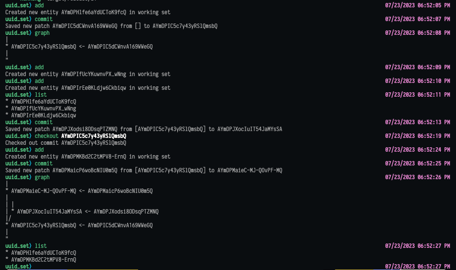

# `chit`: (early experiments toward) a version-control system for structured data

**please note, very little is actually implemented here. this is not useful yet. the on-disk format is far from stabilized.**

### Usage

```
cargo run --release
```


All commits are serialized to disk (in a folder called patches/) and then read back from disk on startup.

## Motivations

1. **The [Open Agency Architecture](https://www.alignmentforum.org/posts/jRf4WENQnhssCb6mJ/davidad-s-bold-plan-for-alignment-an-in-depth-explanation#Fine_grained_Scheme) calls for compositional version-control systems** for causal models as well as specifications. These need to be organized so that both humans and AIs can both navigate and propose patches easily. The models I have in mind will be fundamentally graphical in nature—more like wiring diagrams or pasting diagrams than programs. The standard version-control paradigm of maintaining a repository of files in a syntax language does not facilitate discovery and manipulation for either AIs (which would do better with graph attention) or humans (which would do better with visual representations, at least at some scales).
2. **I've wanted something like this for ages for personal information management**. Roam, Notion, and Airtable barely scratch the itch. They lack adequate version-control features (and, relatedly, offline-first functionality), querying tools, schema evolution, and computational efficiency. And there are new directions I want to explore: bargaining solutions for multi-party meeting scheduling; RL policies for project management in [SDCPN](https://pure.tudelft.nl/ws/portalfiles/portal/139657077/ESREL2021_Final_revised_full_paper_50.pdf) models of R&D roadmaps and business processes; [language model cascades](https://arxiv.org/pdf/2207.10342.pdf) that are both version-controlled as structured data and that operate on other structured data (not just reading your Notion documents and suggesting the next sentence!).
3. **Who knows, maybe the next SQL?** [Codd's relational model](https://en.wikipedia.org/wiki/Relational_model) has been the dominant paradigm for data management for over 50 years. Many have tried to supersede it; all have failed, generally for one or more of a few reasons: (a) computational inefficiency and inability to catch up with decades of optimizations and heuristics, (b) falling short of SQL's level of rigor or expressiveness in schema design, or (c) inability to maintain consistency under concurrency. 

## Inspirations

1. [A Relational Model of Data for Large Shared Data Banks](https://www.seas.upenn.edu/~zives/03f/cis550/codd.pdf), Edgar Codd, 1970. The foundation of most database systems of the past 50 years. If you're trying to do something new and foundational in databases, you have to at least be familiar with this. It's a really good paper! Honorable mention to [The Third Manifesto](https://www.dcs.warwick.ac.uk/~hugh/TTM/DTATRM.pdf) which is in a similar spirit, updated in 2006 and elaborated with the benefit of decades of practical experience, and with a commendable attempt to integrate type theory to bring some rational design to the then-fashionable concept of "inheritance."
2. [Categorical Data Structures for Technical Computing](https://compositionality-journal.org/papers/compositionality-4-5/pdf/), Evan Patterson, Owen Lynch, James Fairbanks, 2021. This is my reference for the concept of ACSets, a highly flexible but extremely formal notion of database instances and schemas.
3. [Data-Parallel Algorithms for String Diagrams](https://arxiv.org/pdf/2305.01041.pdf), Paul Wilson and Fabio Zanasi, 2023. This paper explores highly efficient representations for ACSets that are suitable for GPU acceleration, and also demonstrates how string diagrams (one of the main types of structured data I want to manage) are naturally represented using ACSets.
4. [Better Together: Unifying Datalog and Equality Saturation](https://arxiv.org/pdf/2304.04332.pdf), Yihong Zhang, Yisu Remy Wang, Oliver Flatt, David Cao, Philip Zucker (aka @sandmouth and "Hey There Buddo!"), Eli Rosenthal, Zachary Tatlock, Max Willsey, 2023. Great! This is actually _two_ fewer unifications I have to work out the details of (or to convince you makes sense!); although the categorical semantics is not very well developed, they have incorporated the lattice-variable framework from Flix and Ascent (which I trace back to Kuper's LVars). They are also actively working on an [implementation](https://github.com/egraphs-good/egglog) (in Rust, at that!) which we can take some inspiration from.
5. [Algebraic Semantics of Datalog with Equality](https://arxiv.org/pdf/2302.03167.pdf), Martin Bidlingmaier, 2023. This provides a lot of the categorical semantics I was hoping for in the above reference. It also explains, in very rigorous detail, the inductive definitions of PHL terms, PHL atoms, PHL formulae, and PHL sequents.
6. [Free Join: Unifying Worst-Case Optimal and Traditional Joins](https://arxiv.org/pdf/2301.10841.pdf), Yisu Remy Wang, Max Willsey, Dan Suciu, 2023. One of the reasons I think there might be an opportunity for a paradigm shift in databases is recent sudden progress on worst-case optimal join algorithms from a computational-complexity perspective. This paper provides some missing pieces that make those theoretically appealing algorithms also quite competitive with SQL join algorithms in practice.
7. [A Categorical Theory of Patches](https://citeseerx.ist.psu.edu/document?repid=rep1&type=pdf&doi=68f9718ce423df0c9f5cb094ce47fc93c776c9f6), Samuel Mimram and Cinzia Di Giusto, 2013. Probably the earliest paper proposing an analogy of patches as morphisms, with merges as pushouts.
8. [On lax limits in ∞-categories](https://arxiv.org/pdf/2006.10851.pdf), John Berman, 2020. This isn't a joke; I don't recommend trying to read it, but this paper is what finally gave me an intuition I felt somewhat comfortable with for Grothendieck constructions (they're [oplax colimits](https://ncatlab.org/nlab/show/Grothendieck+construction#AsALaxColimit)), and this intuition was critical for my idea about how to version-control CSet schemas and instances jointly (namely, by taking the Grothendieck construction of a domain fibration). Similarly, but less essentially, I glanced through [Internal enriched categories](https://arxiv.org/pdf/2006.07997.pdf) by Enrico Ghiorzi and a lot while thinking about this project.
9. [Higher Dimensional Categories](https://www.amazon.co.uk/Higher-Dimensional-Categories-Double-Multiple/dp/9811205108), Marco Grandis, 2019. An excellent book on double and multiple categories (my preferred shape for higher-dimensional categories). This directly provided the notion of update between CSets that I plan to use.
10. [1ML: Core and Modules United](https://people.mpi-sws.org/~rossberg/papers/Rossberg%20-%201ML%20--%20Core%20and%20modules%20united.pdf), Andreas Rossberg, 2015. Somewhat tangential, but probably describes "the correct way" to handle *namespaces*, which is an important and oft-neglected aspect of any software framework that can be used to manage large things.
11. [Making CRDTs Byzantine Fault Tolerant](https://martin.kleppmann.com/papers/bft-crdt-papoc22.pdf), Martin Kleppmann, 2022. This explains where and why cryptographic hashes are needed to ensure consistency in a Byzantine setting. An alternative approach is to cryptographically sign updates and use trust. I hope to support both approaches, but right now have only implemented 128-bit UUIDs. Some of Kleppmann's other work, such as [Thinking in Events](https://martin.kleppmann.com/papers/debs21-keynote.pdf), is also tangentially inspirational.
12. [Typed Image-Based Programming With Structure Editing](https://arxiv.org/pdf/2110.08993.pdf), Jonathan Edwards and Tomas Petricek, 2021. Cites the Categorical Theory of Patches and pursues the idea that version-controlling schemas in a structured way alongisde the data that is based on them makes data migration much less challenging.

## Key ideas

These are mostly notes for myself if and when I should come back to this project.

### Sorts

In ACSets, an object of the non-attribute part of the schema (S0) is a sort. S0 itself is the meta-sort of sorts, but does not contain itself or other meta-sorts (such as the meta-sort of attributes). A schema induces a mapping of meta-sorts to sets; an instance additionally induces a mapping of sorts to sets.

An object of the attribute part of the schema (S1) is a (primitive) type.

In the type theory of `chit`, it should be possible to form record types whose fields have types drawn from a mixture of S0 and S1. In this sense both sorts and primitve types are **types**.

In particular, objects of S0 can be thought of as inductive or algebraic data types, generally constituted of a large collection of nullary and anonymous constructors (the unique IDs of elements of that sort). But when we declare functions that map into a sort, we begin to open the possibility of constructing algebraic terms, which may or may not reduce to any particular nullary constructor. Think of it this way: in SQL, PresentKing("France") would return NULL, but in `chit`, PresentKing("France") would return PresentKing("France"). It simply doesn't normalize any further. (Although it should be possible to define Maybe types, and assert that PresentKing("France")=None, this would represent "missing but inapplicable" as distinct from simply "missing". This distinction is one that Codd himself once tried to make but it was shouted down in SQL committee.)

### IDs

There are multiple kinds of IDs that are useful:
0. Patch-Local ID: like a sort-local ID, but even more local, to the elements which are introduced in a given patch.
1. Sort-Local ID: this is the kind which the Julia implementation of ACSets uses almost exclusively. It is a natural number ranging from 0 to to the total number of elements of a given sort at a given version(/instance). These numbers necessarily will overlap between versions, and between different sorts within the same version, but may also vary in unpredictable ways. Thus they are local to a specific sort at a specific verison.
2. Version-Local ID: this is a natural number ranging from 0 to the total number of elements in a version (including the sorts themselves, as elements of S0, etc.).
3. Locally Universal ID: this is a natural number ranging from 0 to the total number of UUIDs that has been seen by this installation of the program.
4. Universally Unique ID (UUID): this is a 128-bit number incorporating a timestamp and some randomness, which is universally unique unless someone has been playing tricks or unless you got astronomically unlucky.
5. Cryptographic-Hash ID (CHID): per Kleppmann, this is a concatenation of a hash (256 bits or more) of a patch followed by the Patch-Local ID of an element which was introduced in that patch.

#### Namings

There is a meta-sort called a "context" whose elements are "namings": associations of a particular UUID or CHID with a particular name (a list of strings) within a version. Patches may delete and add namings (modification is given by deletion followed by addition).

For practical purposes, on the theoretical side, wherever the binary monoidal product appears as a primitive, we should consider replacing it with the formation of a record type. And instead of associativity and swaps, we should think of the structural maps as substitutions-in-context.

But assertions in the database actually only refer to IDs, not to names, so namings are purely a user interface (input/output for humans and large language models). Language models may also have their own kind of ``namings'' that refer to vector embeddings instead of lists of strings, in the spirit of [Quasilinguistic Neural Representations](https://www.alignmentforum.org/posts/FKE6cAzQxEK4QH9fC/qnr-prospects-are-important-for-ai-alignment-research).

It is also an important design desideratum that multiple names can refer to the same entity. There are many reasons for this, ranging from namespace exports to filesystem hardlinks to the simple fact that equalities between entities can always be asserted at the union-find level anyway.

### Custom attribute types

It should be possible to implement custom attributes as Rust types that implement the [rkyv](https://docs.rs/rkyv/latest/rkyv/) traits, and then register them with the UUID of an element of S1 meta-sort. Perhaps ultimately this should take place via loading WebAssembly modules, but a first implementation would simply perform the registration in a macro and require a downstream fork in order to maintain custom attribute types.

### Assertions of logical judgments

All data items in `chit` are in some sense denoting the assertion of some logical judgment. For example, a sort Person denotes the assertion of the judgment |- Person : S0. A person Bob denotes the assertion of the judgment |- AymDPMKBd2C2tMPV8KErnQ : Person, and perhaps the judgment |- Name(AymDPMKBd2C2tMPV8KErnQ) = "Bob" (given a previous assertion of |- Name : Person -> String). Ultimately, `chit` will also be able to represent assertions of sequents with premises, known in Datalog as "rules", which can provide the basis of many things from logic programming to reproducible dataflow computing. Congruence closure of terms relative to deducible equality judgments can be done efficiently with worst-case optimal joins, cf. `egglog`.

#### Partially ordered types

`egglog` brings in the notion of types with partial orders. Following the general vibe of freely adjoining term constructors, we could perhaps simply say that all types have a Join operation and a Bottom constant, along with their universal properties as declared sequents:
```
T : Type, x : T |- Bottom <= x
T : Type, x : T, y : T |- x <= Join(x,y)
T : Type, x : T, y : T |- y <= Join(x,y)
T : Type, x : T, y : T, z : T, x <= z, y <= z |- Join(x,y) <= z
```
If we want to actually define some of these terms (instead of leaving them as freely generated uninterpreted terms), we could do so by asserting their equalities to ground values. If uninterpreted Join terms appear in a database instance without a ground normal form, then the instance is a "conflicted state" analogous to a git repository in the midst of a merge conflict. Committing such states is forbidden, but it is useful to be able to work with them within the formalism.

The way that `egglog` performs merges, it is almost as though typical assertions are of the form
```
|- v <= f(x)
```
rather than
```
|- v = f(x)
```

This suggests thinking about [Directed Type Theory](https://jacobneu.github.io/research/abstracts/HoTT-UF-2022.pdf) in which "equalities" are replaced by (or defined in terms of) directed "paths".

### Elements with parameters

It should be possible to declare a function **from** a primitive type (or a record of primitive types) **to** an uninterpreted sort. If the primitive type is infinite, this notionally breaks the interpretation of instances as always finite. But it enables the construction of infinite diagrams such as in [Monoidal Streams for Dataflow Programming](https://arxiv.org/pdf/2202.02061.pdf). And since primitive types have combinatorial representations, term diagrams that invoke functions on primitive types do too, so this doesn't break the desirable computational properties of having finite instances. (Of course, there are some pathological infinite structures, for example, so-called "real numbers", that still cannot be represented this way, but that is fine; we use floating-point numbers or rationals in practice anyway.)

### Succinct data structures

In these experiments I've made use of the [RoaringTreemap](https://docs.rs/roaring/latest/roaring/treemap/struct.RoaringTreemap.html), based on Daniel Lemire's [Roaring Bitmaps](https://lemire.me/en/publication/arxiv14026407/), widely used in database indices, to represent sets of `u64`s (the various kinds of ID short of level 4 are all `usize`s, which I assume fits in `u64`). Other data structures filling this role, such as Partitioned Elias-Fano and [la_vector](https://github.com/gvinciguerra/la_vector), should be considered and evaluated in the fullness of time. Also, [RangeSetBlaze](https://github.com/CarlKCarlK/range-set-blaze) could probably be easily extended to support `rank` and `select` queries, and then could fill this role as well (perhaps best for the `version_universe` index).

### Patches as vertical natural transformations

If we consider CSets as double functors from horizontal double categories into the double category FinRel (which has functions as horizontal morphisms and relations as vertical morphisms), then there is a very natural construction of what it means to be a "patch" between a C0Set and a C1Set: a functor from C0 to C1, equipped with a vertical natural transformation that fills the slice triangle. What this cashes out to, with UUIDs in play, turns out to be a partial function between every sort in the first instance and its (unique) corresponding sort in the second instance. (It's really a relation, but the squares with the UUID attribute can only commute if no elements on the left have multiple related elements on the right.) Add the principle that a previously deleted UUID may never be added again, and you get the convenient lemma that elements with the same UUID are always related, and the only way for elements to be related without sharing the same UUID is if there is a "merge" of one UUID into the other recorded in some patch. (Perfect for a union-find data structure.) Patches are thus recorded, at the sort level (`UuidSetPatch`), as deletions followed by merges followed by additions (exploiting Lack's [spider theorem](https://graphicallinearalgebra.net/tag/spider-theorem/)).

### Submodules

As mentioned earlier, namespaces are often neglected. I hope to get this right, but I'm not sure I have the answer yet. My best idea is that an "import" - which brings in certain named entities from a completely separate repository or branch, under a certain renaming policy - should be a primitive operation, like additions and deletions. This particular operation should be annotated with a "fully qualified branch name": a hostname, account name, repo name, and branch name. And the interface should make it easy to try to "rebase" such operations by fetching the latest authenaticated version of that branch (the equivalent of updating submodules). 
